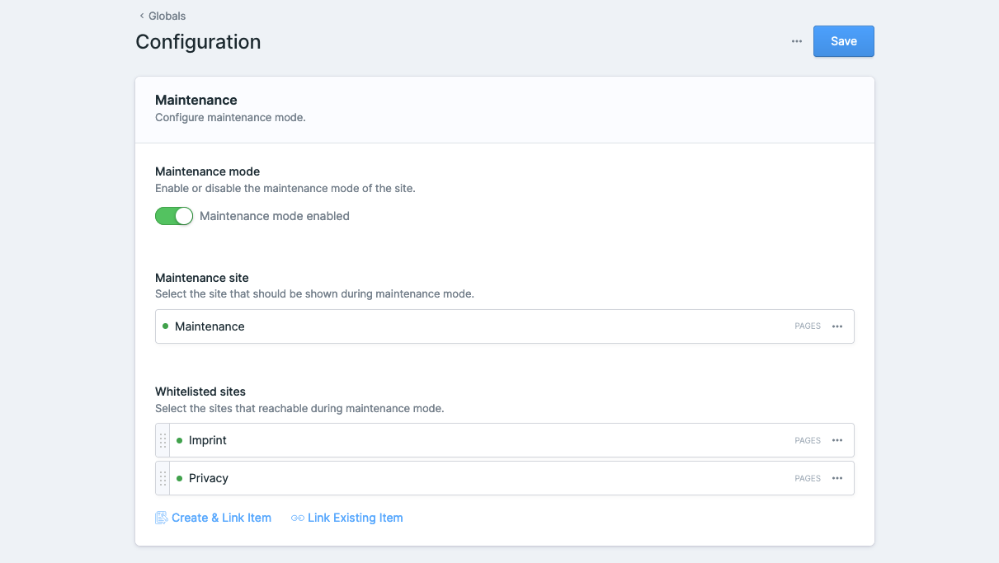

<!-- statamic:hide -->
# Statamic Maintenance Mode


<!-- /statamic:hide -->


> This is a tiny addon for Statamic CMS that allows easily to set your site into maintenance mode. When in maintenance mode, visitors to the site will see a customizable maintenance page, and administrators will be able to access the site normally.



## How to Install

You can search for this addon in the `Tools > Addons` section of the Statamic control panel and click **install**, or run the following command from your project root:

``` bash
composer require wahlemedia/statamic-maintenance-mode
```

## How to configure (optional)

You can override the default options by publishing the configuration:

```
php artisan vendor:publish --provider="Wahlemedia\StatamicMaintenanceMode\ServiceProvider" --tag=config
```

This will copy the default config file to `config/statamic/maintenance_mode.php`.

## How to Use

1. Create a new maintance page under your page collection
2. Go under `Utilites > Maintenance` to select a maintance site and enable / disable maintance mode 

## Issues and Support
If you encounter any issues or have questions, please create an issue on the [GitHub](https://github.com/wahlemedia/statamic-maintenance-mode/issues) repository for this addon.

## License
This addon is released under the [MIT License](LICENSE.md).
